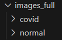
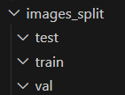

# Classificação de Imagens de Raio-X por Wavelets

## Resumo
Este projeto tem como objetivo a classificação de imagens de raio-X divididas em duas classes: COVID e normal. A abordagem utiliza descritores de imagem para extrair características das imagens e classificadores para diferenciar as classes com base nessas características.

## Dataset
O dataset utilizado para desenvolvimento foi o [Covid-19 & Normal](https://www.kaggle.com/datasets/tarandeep97/covid19-normal-posteroanteriorpa-xrays), que está disponível no Kaggle.

## Requisitos para o Desenvolvimento
Alterações no Código: O projeto foi desenvolvido a partir de um código base disponibilizado no Moodle. A principal alteração inclue a implementação de um novo tipo de descritor para a extração de características das imagens - **"Wavelet"**, a unificação dos classificadores em um único arquivo e a separação dos dados em conjuntos de treinamento, validação e teste.

## Descritor Implementado - Wavelet
O descritor utilizado para classificação foi o Wavelet, que é uma ferramenta matemática cujas funções decompõem uma imagem de entrada em diferentes componentes de frequência. Neste projeto foi utilizada a Transformada Discreta de Wavelet (DWT, do inglês *Discrete Wavelet Transform*). A decomposição permite a extração de características que representam componentes de imagens como curvas e formas.

## Classificadores e Acurácias
Os seguintes classificadores foram utilizados:

- MLP: Acurácia média de 92%
- Random Forest: Acurácia média de 92%
- SVM: Acurácia média de 97%

## Dados de Entrada
Imagens e rótulos (labels): Utiliza-se um conjunto de imagens e seus respectivos rótulos.

## Dados de Saída
- Matriz de Confusão
- Acurácia dos Classificadores  
Gravados na pasta `results`.

## Implementação
O projeto foi desenvolvido em Python e inclui as seguintes etapas principais:

Pré-processamento das Imagens: Carregamento das imagens, conversão das imagens para tons de cinza e redimensionamento.  
Extração de Características: Utilização do descritor Wavelet para extrair características das imagens.  
Codificação dos Rótulos: Uso do LabelEncoder para codificação das etiquetas das classes.  
Divisão do Conjunto de Dados: Inclusão de conjuntos de treino, teste e validação.  
Treinamento do Classificador: Treinamento do modelo de classificação utilizando algoritmos MLP, RF e SVM.  
Avaliação do Modelo: Avaliação do desempenho do classificador através da matriz de confusão e acurácia.  

## Resultados
Os resultados do projeto incluem a matriz de confusão e a acurácia do classificador para as classes COVID e normal.

## Como Executar o Projeto
1. Instale as dependências: pip install -r requirements.txt;
2. Coloque as imagens do dataset a ser utilizado dentro da pasta `images_full`, com cada classe de imagens isolada em uma pasta própria dentro de `images_full`;

3. Para a divisão dos dados em conjuntos de treinamento, teste e validação, certifique-se de que as pastas `test`, `train` e `val` na pasta `images_split` estejam vazias. Então, execute o arquivo `data_splitting.py` na pasta `dataSplitter`;

4. Execute o script python `wavelet_FeatureExtraction.py`;
5. Execute o script python `classifiers.py`;
6. Escolha o descritor e depois o classificador no menu;
7. Os resultados (Matriz de confusão e acurácia do(s) classificador(es)) serão gravados na pasta `results` no formato png com o nome do descritor, modelo de classificação utilizado e data e hora no nome para identificação única do arquivo.